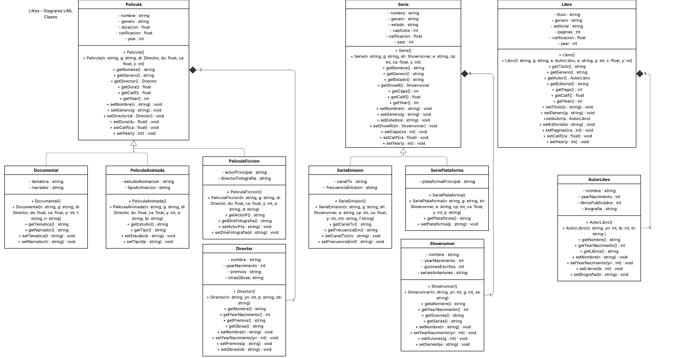

# LiKes
## Contexto y funcionalidad
LiKes es un programa inspirado en aplicaciones como Letterboxd, pero un tanto diferente. La funcionalidad principal es que el programa puede almacenar, consultar y agregar todos tus LiKes. ¿Pero qué son LiKes? Tus LiKes se refieren a tus películas, series y tus libros favoritos. La idea es poder agregar a tu gusto uno de ellos, poniendo diferentes datos de la obra, como nombre, información del director o del autor y más, todo dependiendo del tipo de obra que estés almacenando. También te pide ponerle una calificación a dicha obra del 1 al 10. Puedes agregar un máximo de 100 obras por cada tipo y puedes agregar diferentes tipos de películas y series, como películas animadas, documentales, ficción, o series en emisión o series de plataformas digitales, y el programa te deja consultar todos tus LiKes, agregar LiKes y consultar las características de una obra en específico. La idea es tener en un solo lugar tus obras favoritas y poder consultar sus características a tu gusto.
## Conideraciones
El programa solo corre en la consola y esta hecho con c++ standard por lo que corre en todos los sistemas operativos

## Diagrama de clases

## Estilo del código
Para el código se utiliza el formateador ClangFormat. En el archivo `.clang-format` se encuentra el estilo específico utilizado en este proyecto.
## Compilacion e instalacion
Para compilar el programa, instala los .h y el main.cpp, debido a que en main se incluyen todos los .h, solo es necesario compilar el main.

### Linux

Compilación: `g++ main.cpp -o LiKes`

Ejecución: `./LiKes`

### Windows

Compilación: `g++ main.cpp -o LiKes.exe`

Ejecución: `.\LiKes.exe`

## Correcciones
En este programa se hicieron las siguientes correcciones:
1. Se agregó cardinalidad al diagrama de clases y se cambiaron las agregaciones por composiciones.
2. Se agregaron comentarios y reglas de estilo a todos los archivos.
